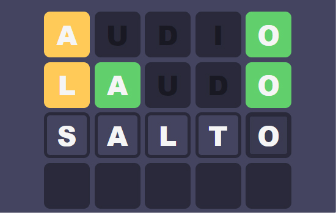

# CLONE DO JOGO [TERMO](https://term.ooo/) EM HTML, CSS E JAVASCRIPT.

Projeto realizado como método de aprendizagem das ferramentas citadas.

## Como funciona?

O objetivo é acertar a palavra correta em um número limitado de tentativas. Após preencher uma palavra de 5 letras e apertar `enter`, as letras seguirão o seguinte esquema de cores:

• Letras em  `verde` estão na posição correta.

• Letras em `amarelo` existem na palavra, mas estão na posição errada.

• Letras `sem cor` não existem na palavra desconhecida.

 
• Apenas letras de A-Z são permitidas.
 
• Acentos, números, símbolos e letras como "ç" não são consideradas.

